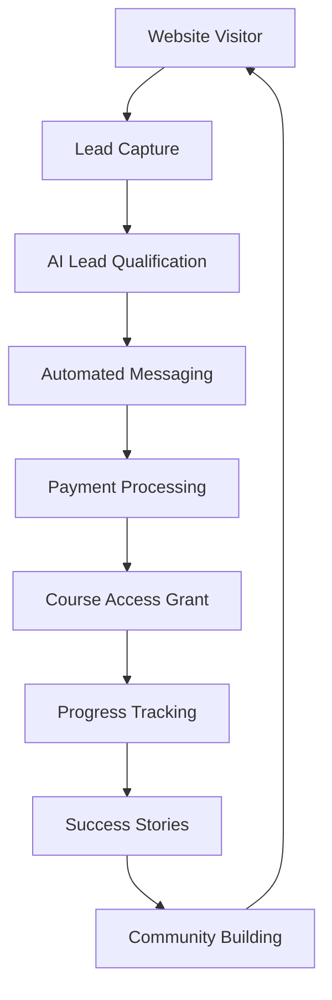

# 🎓 VIBES UNIVERSITY AI SYSTEM

**Complete AI Automation Platform for Nigerian Entrepreneurs**

A comprehensive system that combines course hosting, payment processing, AI automation, and messaging bots to create a fully automated educational business platform.

## 🚀 Quick Start

### 1. One-Command Setup
```bash
# Make the startup script executable
chmod +x start_vibes_system.sh

# Start the complete system
./start_vibes_system.sh start
```

### 2. Manual Setup (Alternative)
```bash
# Install dependencies
pip install -r requirements.txt

# Setup environment
cp env_template.txt .env
# Edit .env with your API keys

# Start the system
python3 unified_startup.py
```

## 🏗️ System Architecture

### Core Components

#### 1. **Course Platform** (`app.py`)
- **Port**: 5000
- **Purpose**: Main course hosting and enrollment platform
- **Features**:
  - User registration and authentication
  - Course enrollment and payment processing
  - Progress tracking
  - Payment gateway integration (Paystack, Flutterwave)

#### 2. **AI Dashboard** (`api_server.py`)
- **Port**: 5001
- **Purpose**: AI automation control center
- **Features**:
  - Real-time system monitoring
  - AI agent management
  - Lead generation automation
  - Performance analytics

#### 3. **AI Automation System** (`vibes_ai_system.py`)
- **Purpose**: Core AI automation logic
- **Components**:
  - Lead Generation Agent
  - Email Marketing Agent
  - Social Media Agent
  - Customer Support Agent
  - Analytics Agent

#### 4. **Messaging Automation** (`messaging_bots.py`)
- **Purpose**: WhatsApp and Telegram automation
- **Features**:
  - Automated lead nurturing
  - Payment reminders
  - Success story broadcasting
  - Community management

#### 5. **Payment Processing** (`payment_processor.py`)
- **Purpose**: Payment gateway integration
- **Supported**:
  - Paystack
  - Flutterwave
  - Cryptocurrency (Bitcoin, USDT)
  - Manual payment verification

#### 6. **Website Integration** (`integration.py`)
- **Purpose**: Connect marketing website with course platform
- **Features**:
  - Payment verification
  - Access token generation
  - Seamless user experience

## 📊 System Flow



## 🔧 Configuration

### Environment Variables

Copy `env_template.txt` to `.env` and configure:

```bash
# Payment Gateways
PAYSTACK_SECRET_KEY=your_paystack_secret
FLUTTERWAVE_SECRET_KEY=your_flutterwave_secret

# Messaging
WHATSAPP_API_TOKEN=your_whatsapp_token
TELEGRAM_BOT_TOKEN=your_telegram_token

# Email
EMAIL_USER=your_email@gmail.com
EMAIL_PASSWORD=your_app_password

# AI
OPENAI_API_KEY=your_openai_key
```

### Course Pricing

Configure in `.env`:
```bash
COURSE_PRICE=100000          # ₦100,000
ONLINE_CLASSES_PRICE=300000  # ₦300,000
VIP_PHYSICAL_PRICE=2000000   # ₦2,000,000
```

## 🌐 Access Points

### Course Platform
- **URL**: http://localhost:5000
- **Purpose**: Main course website
- **Features**: Enrollment, payments, course access

### AI Dashboard
- **URL**: http://localhost:5001
- **Purpose**: System monitoring and control
- **Features**: Real-time metrics, automation control

### API Endpoints
- **Base URL**: http://localhost:5001/api
- **Endpoints**:
  - `GET /api/status` - System status
  - `POST /api/run-automation` - Trigger automation
  - `GET /api/leads` - View leads
  - `POST /api/send-email-campaign` - Send campaigns

## 🤖 AI Automation Features

### Lead Generation
- Automated social media scraping
- AI-powered lead qualification
- Real-time lead scoring

### Email Marketing
- Personalized email campaigns
- FOMO-driven messaging
- Automated drip sequences

### Social Media
- Viral content generation
- Automated posting
- Success story broadcasting

### Customer Support
- 24/7 AI support
- Intelligent ticket routing
- Knowledge base integration

### Payment Processing
- Multi-gateway support
- Automated enrollment
- Payment verification

## 📈 Performance Metrics

### Target KPIs
- **Lead Generation**: 30-50 leads/day
- **Conversion Rate**: 20-30%
- **Email Open Rate**: 35-45%
- **Customer Satisfaction**: 4.5+/5.0

### Revenue Projections
- **Year 1 Target**: ₦2,000,000,000
- **Monthly Target**: ₦166,000,000
- **Daily Target**: ₦5,500,000

## 🛠️ Management Commands

### System Control
```bash
# Start complete system
./start_vibes_system.sh start

# Setup only (no start)
./start_vibes_system.sh setup

# Check system status
./start_vibes_system.sh status

# Show help
./start_vibes_system.sh help
```

### Manual Operations
```bash
# Run daily automation manually
python3 -c "from vibes_ai_system import VibesUniversityAI; ai = VibesUniversityAI(); ai.run_daily_automation()"

# Generate leads manually
python3 -c "from vibes_ai_system import VibesUniversityAI; ai = VibesUniversityAI(); ai.lead_agent.process_new_leads()"

# Send email campaign
python3 -c "from vibes_ai_system import VibesUniversityAI; ai = VibesUniversityAI(); ai.email_agent.send_email_campaign('nurture', 'new')"
```

## 🔍 Troubleshooting

### Common Issues

#### 1. Port Already in Use
```bash
# Check what's using the ports
lsof -i :5000
lsof -i :5001

# Kill processes if needed
kill -9 <PID>
```

#### 2. Database Errors
```bash
# Reinitialize database
python3 -c "from vibes_ai_system import DatabaseManager; DatabaseManager()"
python3 -c "from app import init_db; init_db()"
```

#### 3. API Key Issues
```bash
# Check environment variables
python3 -c "import os; print('PAYSTACK_SECRET_KEY:', bool(os.getenv('PAYSTACK_SECRET_KEY')))"
```

#### 4. Log Files
```bash
# View system logs
tail -f vibes_system.log
tail -f api_server.log
tail -f ai_system.log
```

### Performance Optimization

#### Database
- Index frequently queried columns
- Regular database maintenance
- Backup strategy implementation

#### Caching
- Redis for session storage
- File caching for static content
- API response caching

#### Scaling
- Load balancing for high traffic
- Microservices architecture
- Container deployment (Docker)

## 🔐 Security

### Best Practices
- Keep API keys secure in `.env` file
- Regular security updates
- HTTPS for all endpoints
- Webhook signature verification
- Rate limiting implementation

### Production Deployment
- Use production database (PostgreSQL)
- Implement proper logging
- Set up monitoring and alerting
- Regular backups
- SSL certificate configuration

## 📚 Course Content

The system includes comprehensive course modules:

### Module 1: Foundations
- AI E-commerce Foundations
- AI Tools Landscape & Strategy
- Business Process Automation
- AI Marketing Foundations
- AI Content Creation
- AI Coding Foundations

### Module 2: Tools & Techniques
- Essential AI Tools for Business
- AI E-commerce Tools & Platforms
- AI Business Process Automation
- AI Content Creation Techniques
- AI Marketing Automation
- AI-Powered Video Editing
- AI Music Production
- AI IT Management
- AI Sales Automation
- AI Coding Workflows

### Module 3: Implementation
- AI Finance Automation
- AI Product Research & Selection
- AI Income Strategies
- Advanced AI Content Monetization
- AI E-commerce Optimization
- AI Process Automation
- Advanced AI Tools Integration

### Module 4: Advanced Strategies
- Advanced AI Marketing Analytics
- Advanced AI Coding Techniques
- Advanced AI Marketing Strategies
- Advanced AI E-commerce Strategies
- Advanced AI Tools Integration

## 🎯 Success Stories

The system is designed to generate and broadcast success stories:

- **Chioma**: ₦800,000/month in 3 months
- **Emeka**: ₦2.5M/month from AI coding
- **David**: ₦3M/month at age 22

## 📞 Support

For technical support:
- Check log files for detailed error messages
- Review system status via dashboard
- Contact development team for complex issues

## 🚀 Deployment

### Local Development
```bash
./start_vibes_system.sh start
```

### Production Deployment
1. Set up production server
2. Configure environment variables
3. Set up reverse proxy (Nginx)
4. Configure SSL certificates
5. Set up monitoring and backups
6. Deploy using Docker or direct deployment

---

**🎓 VIBES UNIVERSITY AI SYSTEM**
*Complete AI Automation Platform for Maximum Revenue*

Built with ❤️ for Nigerian entrepreneurs ready to escape economic collapse through AI automation. 